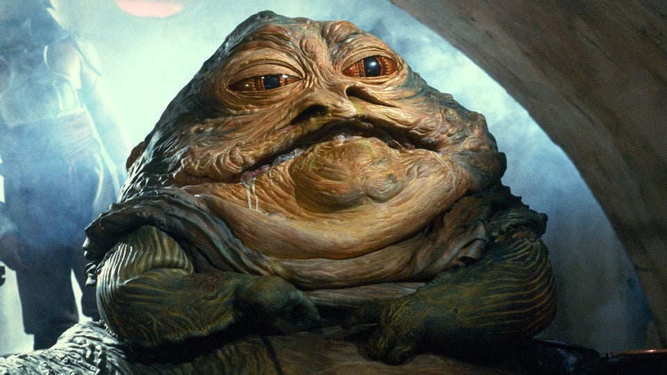

```{r setup, include=FALSE}
knitr::opts_chunk$set(
	echo = FALSE,
	message = FALSE,
	warning = FALSE
)
library(tidyverse)
library(ggthemes)
library(RColorBrewer)
library(ggrepel)

data("starwars")
```

```{css, echo=FALSE}

.inverse {
  background-color: #132734;
  color: #d6d6d6;
  text-shadow: 0 0 20px #333;
}

.title-slide {
  background-color: #132734;
  color: #d6d6d6;
  text-shadow: 0 0 20px #333;
  class: inverse, center, middle;
  background-image: url('img/logo.png');  
  background-position: 5% 98%;  
  background-size: 150px ;
}

body { font-family: 'Open Sans' }

h1, h2, h3 {
  font-family: 'Ubuntu';
  font-weight: normal;
}

```

## Top 5 Tips  

### 1. Clearly define your goals beforehand   
### 2. Keep it simple  
### 3. Think about data-to-ink ratio  
### 4. Colours matter   
### 5. Use clear labels, titles and units 

---


## Top 5 Tips  

### 1. Clearly define your goals beforehand  
  - Are you comparing across groups or over time?  
  - How many variables are involved and what type are they?
  - Are you showing a relationship?  
  - Aim to build your chart to answer just the question you set yourself  

---

## Top 5 Tips  

### 2. Keep it simple  
  - Just one y-axis    
  - Consider using facets or multiple charts over crowded, grouped charts   
  - Stick to 2D and avoid pie charts  

---

# Top 5 Tips  

### 3. Think about data-to-ink ratio
  - Are you wasting ink on backgrounds, boxes, lines, ticks, labels?  
  - Is the ink you are using conveying useful information?

---
## Top 5 Tips   

### 4. Colours matter  
 - Use colour as a dimension, not as a decoration  
 - Be mindful of colour-blindness and correct perception  

---
## Top 5 Tips    

### 5. Use clear labels, titles and units    
  - People aren't mind readers  
  - Be unambiguous and honest  

---
## A Bad Example    

Here is what not to do..

```{r fig.width=12}
starwars %>% 
  filter(!str_detect(name, "Jabba")) %>% 
  select(name, height, mass) %>% 
  gather(attr, val, -name) %>% 
  ggplot(aes(name, val, fill = attr, label = val)) +
  geom_bar(stat = "identity", position = "dodge") +
  geom_text() +
  theme_excel() +
  theme(axis.text.x = element_text(angle = 90)) +
  labs(x = "", 
       y = "",
       title = "heights and weights of characters")
```

---
## 1. Clearly define your goals beforehand   

> We want to explore the size of Star Wars characters by assessing the 
relationship of body height and weight.  

---
## 2. Keep it simple 

A basic, 2D scatter plot to show the main relationship between our two continuous 
variables.  

```{r fig.height=6, fig.width=11, dpi = 400}
starwars %>%
  ggplot(aes(mass, height)) +
  geom_point()
```

---
## 3. Think about data-to-ink ratio

There is lots of empty space due to an outlier. 

```{r fig.height=6, fig.width=11, dpi = 400}
starwars %>%
  ggplot(aes(mass, height)) +
  geom_point() +
  geom_point(data = filter(starwars, str_detect(name, "Jabba")), aes(mass, height), colour = "red", size = 8, type = 1, alpha = 0.3)
```

---
## 3. Think about data-to-ink ratio

There is lots of empty space due to an outlier. 



---
## 3. Think about data-to-ink ratio

By removing Jabba The Hutt and we get a better use of the data space.

```{r fig.height=6, fig.width=11, dpi = 400}
starwars %>% 
  filter(!str_detect(name, "Jabba")) %>% 
  ggplot(aes(mass, height)) +
  geom_point()
```

---
## 4. Colours matter  

Let's make use of colour by adding a different colour for each species.  

```{r fig.height=6, fig.width=11, dpi = 400}
starwars %>% 
  filter(!str_detect(name, "Jabba")) %>% 
  ggplot(aes(mass, height, colour = species)) +
  geom_point()
```

Way too many species are present in the data. We can see the characters are 
mainly Human, Droid and a long tail of others. 

---
## 4. Colours matter 

We can lump some of these together. 

```{r fig.height=6, fig.width=11, dpi = 400}
starwars %>% 
  filter(!str_detect(name, "Jabba")) %>% 
  replace_na(list(species = "Not Stated")) %>% 
  mutate(species = fct_lump(species, 4)) %>% 
  ggplot(aes(mass, height, colour = species)) +
  geom_point() 
```

---
## 4. Colours matter 

Be careful choosing a colour scale. We need to consider accessibility 
and also perception.  

Here are some palettes that are colour blind friendly and fall into a few groups:  

+ Sequential  
+ Qualitative  
+ Diverging  

---
## Sequential  

```{r fig.height=6, fig.width=6, dpi = 100}
display.brewer.all(colorblindFriendly = TRUE, type = "seq")
```

---
## Qualitative  
```{r fig.height=6, fig.width=6, dpi = 100}
display.brewer.all(colorblindFriendly = TRUE, type = "qual")
```

---
## Diverging  
```{r fig.height=6, fig.width=6, dpi = 100}
display.brewer.all(colorblindFriendly = TRUE, type = "div")
```


---
## 4. Colours matter 

The viridis scales provide colour maps that are perceptually uniform in both colour and black-and-white. They are also designed to be perceived by viewers with common forms of colour blindness. See also https://bids.github.io/colormap/.

```{r fig.height=6, fig.width=11, dpi = 400}
starwars %>% 
  filter(!str_detect(name, "Jabba")) %>% 
  replace_na(list(species = "Not Stated")) %>% 
  mutate(species = fct_lump(species, 4)) %>% 
  ggplot(aes(mass, height, colour = species)) +
  geom_point() +
  scale_colour_viridis_d(direction = -1)
```

---
## 5. Use clear labels, titles and units 

We don't want the chart to be a data table, let's add labels using just the
top and bottom character from each category.  

```{r fig.height=6, fig.width=11, dpi = 400}
starwars %>% 
  filter(!str_detect(name, "Jabba")) %>% 
  replace_na(list(species = "Not Stated")) %>% 
  mutate(species = fct_lump(species, 4)) %>% 
  group_by(species) %>% 
  mutate(label = case_when(
    height == max(height, na.rm = TRUE) ~ name,
    height == min(height, na.rm = TRUE) ~ name
    )) %>% 
  ggplot(aes(mass, height, colour = species, label = label)) +
  geom_point() +
  scale_colour_viridis_d(direction = -1) +
  geom_label_repel(show.legend = FALSE, size = 3)
```

---
## 5. Use clear labels, titles and units 

Lets fix the axes labels, add units, proper titles and a nice minimal theme.

```{r fig.height=6, fig.width=11, dpi = 400}
starwars %>% 
  filter(!str_detect(name, "Jabba")) %>% 
  replace_na(list(species = "Not Stated")) %>% 
  mutate(species = fct_lump(species, 4)) %>% 
  group_by(species) %>% 
  mutate(label = case_when(
    height == max(height, na.rm = TRUE) ~ name,
    height == min(height, na.rm = TRUE) ~ name
    )) %>% 
  ggplot(aes(mass, height, colour = species, label = label)) +
  geom_point() +
  scale_colour_viridis_d(direction = -1) +
  geom_label_repel(show.legend = FALSE, size = 3) +
  labs(y = "Height (cm)",
       x = "Weight (kg)",
       colour = "Species",
       title = "How big are Star Wars characters?",
       subtitle = "Comparing height and weight (where known) of star wars characters - excluding Jabba the Hutt",
       caption = "Source: This data comes from SWAPI, the Star Wars API, http://swapi.co/") +
  theme_minimal()

```

---
##  The finished product  


```{r fig.height=6, fig.width=11, dpi = 400}
starwars %>% 
  filter(!str_detect(name, "Jabba")) %>% 
  replace_na(list(species = "Not Stated")) %>% 
  mutate(species = fct_lump(species, 4)) %>% 
  group_by(species) %>% 
  mutate(label = case_when(
    height == max(height, na.rm = TRUE) ~ name,
    height == min(height, na.rm = TRUE) ~ name
    )) %>% 
  ggplot(aes(mass, height, colour = species, label = label)) +
  geom_point(size = 2, alpha = 0.5) +
  scale_colour_viridis_d(direction = -1) +
  geom_label_repel(show.legend = FALSE, size = 4) +
  labs(y = "Height (cm)",
       x = "Weight (kg)",
       colour = "Species",
       title = "What is the body size of Star Wars characters?",
       subtitle = "Comparing height and weight (where known) of star wars characters - excluding Jabba the Hutt",
       caption = "Source: This data comes from SWAPI, the Star Wars API, http://swapi.co/") +
  theme_minimal()

```

---
Much better than the ugly bar chart  

```{r fig.height=6, fig.width=11, dpi = 400}
starwars %>% 
  filter(!str_detect(name, "Jabba")) %>% 
  select(name, height, mass) %>% 
  gather(attr, val, -name) %>% 
  ggplot(aes(name, val, fill = attr, label = val)) +
  geom_bar(stat = "identity", position = "dodge") +
  geom_text() +
  theme_excel() +
  theme(axis.text.x = element_text(angle = 90)) +
  labs(x = "", 
       y = "",
       title = "heights and weights of characters")
```

---

## Top 5 Tips  

### 1. Clearly define your goals beforehand   
### 2. Keep it simple  
### 3. Think about data-to-ink ratio  
### 4. Colours matter   
### 5. Use clear labels, titles and units 

---
class: inverse, center, middle
background-image: url('img/logo.png')  
background-position: 5% 98%  
background-size: 150px  

# Thanks!

https://www.internetrix.com.au/services/data-science/  

